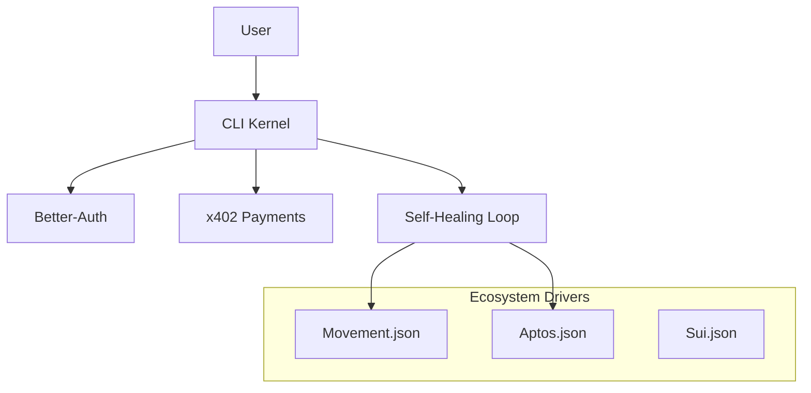

# MoveCoder: The Self-Updating Web3 Coding Agent

> "Web3 moves faster than AI training. MoveCoder is the first CLI agent that doesn't just 'know' Move—it learns it."


## The Problem
In Web3, by the time an LLM is trained on a new SDK, that SDK is already three versions behind. Documentation is often scarce, out-of-date, or scattered across Discord channels and GitHub repos. Developers spend more time fighting breaking changes than building features.

## The Solution: Real-Time Learning Architecture
MoveCoder shifts the paradigm. Instead of relying solely on pre-trained knowledge, it combines a chain-agnostic **Core Kernel** with hot-swappable **Ecosystem Drivers**. This ensures you are always building on the bleeding edge of the Movement Network (and beyond).

### 1. The Core Agent Kernel
Think of this as the operating system. It handles the universal developer needs:
- **CLI Interface:** A polished, interactive terminal experience.
- **Identity & Auth:** Secure user management via **Better-Auth**.
- **Economic Layer:** Integrated crypto payments via **Coinbase x402**.
- **Self-Healing Loop:** The intelligent loop of `Generate -> Build -> Error -> Analyze -> Fix`.

### 2. Ecosystem Drivers (The "Source Code")
MoveCoder is powered by lightweight, configurable drivers that define the "reality" of a specific blockchain. 
*   **Docs Source:** Pointers to the latest GitHub repos or raw documentation files (avoiding stale training data).
*   **Toolchain:** Exact commands for building, testing, and deploying (e.g., `movement move build` vs `aptos move build`).
*   **Error Intelligence:** Maps of common compiler error codes to specific fix strategies.

## Getting Started

### Prerequisites
- [Bun](https://bun.sh) (Package Manager & Runtime)
- [Movement CLI](https://docs.movementlabs.xyz) (for the Movement driver)

### Installation
```bash
# Clone the repo
git clone https://github.com/yourusername/movecoder.git
cd movecoder

# Install dependencies
bun install

# Start the dev server (for auth)
bun run dev start-server

# In a new terminal, run the CLI
bun run dev -- help
```

## Usage

### 1. Select Your Driver
By default, MoveCoder loads the **Movement** driver. You can specify others (future support):
```bash
movecoder config --set-driver movement
```

### 2. Generate with Real-Time Context
```bash
movecoder generate "Create a lending pool with flash loan support"
```
*The agent will pull context from the driver's defined documentation sources before generating code.*

### 3. The Self-Healing Build
```bash
movecoder build
```
*If the build fails, MoveCoder intercepts the error, checks the driver's error map, adjusts the code, and retries automatically.*

## Architecture: The "Web3 Kernel"



## Contributing
We welcome contributions to both the Core Kernel and new Ecosystem Drivers.
- **Kernel:** TypeScript, Bun, Commander.js
- **Drivers:** JSON configuration files in `src/drivers/`

## License
MIT
